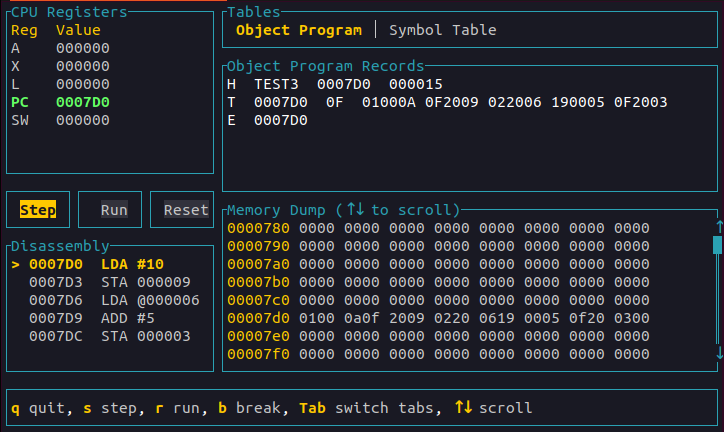

# HexE - SIC/XE Assembler & Simulator

A comprehensive toolchain for the SIC/XE (Simplified Instructional Computer - Extended) architecture, featuring a two-pass assembler, loader, disassembler, and an interactive TUI-based debugger.



## Features

- **Two-Pass Assembler**: Generates symbol tables and object code with full support for SIC/XE instruction formats
- **Loader**: Parses and loads object programs into memory
- **Disassembler**: Converts object code back to assembly mnemonics
- **Interactive Debugger**: Terminal-based UI for step-by-step execution and real-time state inspection
- **Complete Instruction Set**: Supports all SIC/XE instructions (Format 1, 2, 3, and 4)
- **Addressing Modes**: PC-relative, base-relative, immediate, indirect, and indexed addressing
- **Assembler Directives**: START, END, BYTE, WORD, RESB, RESW, BASE, and more

## Getting Started

### Prerequisites

- Rust 1.70 or higher
- Cargo package manager

### Installation

```bash
git clone https://github.com/SWASTIC-7/HexE
cd HexE
cargo build --release
```

### Usage

**Assemble and simulate a source file:**
```bash
cargo run -- program.asm
```

**Load and simulate an object program:**
```bash
cargo run -- program.txt
```

## TUI Simulator

The interactive debugger provides real-time visualization of the machine state during program execution.

### Interface Components

| Component | Description |
|-----------|-------------|
| **CPU Registers** | Current values of A, X, L, PC, and SW registers |
| **Disassembly** | Assembly listing with PC indicator (`>`) |
| **Object Code** | Hexadecimal object code at each address |
| **Symbol Table** | Labels and their corresponding addresses |
| **Memory Dump** | Complete memory view in hexdump format |

### TUI Keyboard Controls

| Key | Function |
|-----|----------|
| `q` | Exit simulator |
| `s` | Execute single instruction |
| `r` | Run until breakpoint or completion |
| `b` | Set breakpoint at current PC |
| `Tab` | Switch between Object Code and Symbol Table |
| `↑` `↓` | Scroll through memory |
| `←` `→` | Navigate control buttons |
| `Enter` | Activate selected button |

## Architecture

### Assembler Pipeline

1. **Pass 1**: Symbol table generation, location counter management
2. **Pass 2**: Object code generation, address resolution

### Object Program Format

```
H^PROGNAME^001000^000100    Header record
T^001000^1E^4B1000...        Text record with object code
E^001000                     End record
```

### Supported Formats

- **Format 1**: Single-byte instructions (e.g., FIX, FLOAT)
- **Format 2**: Two-byte register operations (e.g., CLEAR, COMPR)
- **Format 3**: Three-byte with 12-bit displacement
- **Format 4**: Four-byte extended with 20-bit address

## Testing

Run the test suite:
```bash
cargo test
```

Tests are executed serially to avoid global state conflicts.

## Project Structure

```
HexE/
├── src/
│   ├── assembler/     # Two-pass assembler implementation
│   ├── disassembler/  # Object code to assembly converter
│   ├── loader/        # Object program loader
│   ├── simulator/     # Execution engine
│   ├── tui/          # Terminal UI components
│   └── predefined/    # Opcode tables and definitions
├── tests/            # Integration tests
└── reference_material/ # Documentation and screenshots
```

## Development Status

- [x] Complete SIC/XE instruction set
- [x] All addressing modes
- [x] Symbol table generation
- [x] Object code generation
- [x] Memory visualization
- [ ] Literal pool support
- [ ] External references
- [x] Control sections
- [ ] EQU support
- [ ] Debugger
- [ ] Relocation
- [ ] Linker

## License

This project is developed for educational purposes.

## Acknowledgments

Built following the SIC/XE architecture specification from "System Software: An Introduction to Systems Programming" by Leland L. Beck.